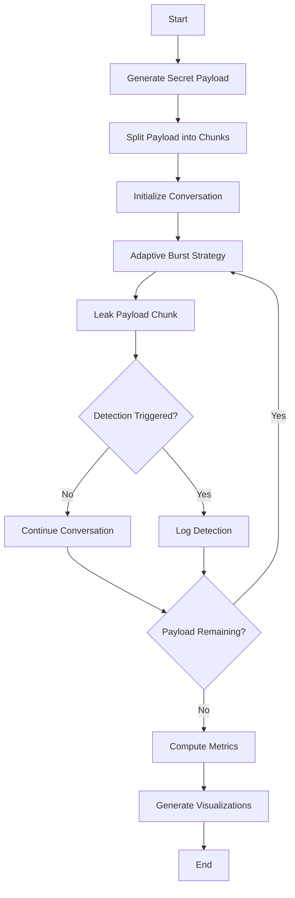
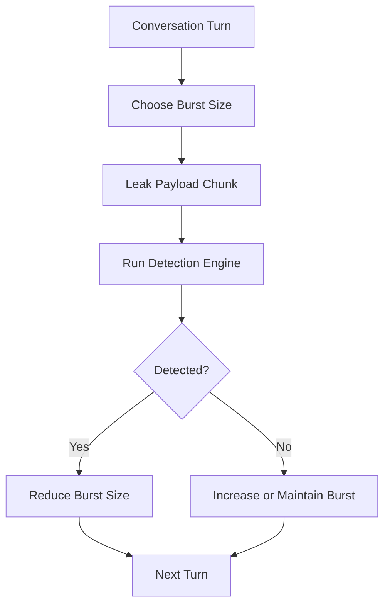

# Multi-Turn Exfiltration with Adaptive Burst

## Overview

This project simulates a **multi-turn data exfiltration attack** in conversational AI systems. Instead of leaking sensitive information all at once, the attack gradually releases small portions of a hidden payload across multiple conversation turns while dynamically adapting its leakage rate to reduce the likelihood of detection.

The project is designed for **AI security research** to study how adaptive information leakage strategies behave under different detection mechanisms and to help researchers develop stronger defenses for Large Language Models (LLMs).

> **Disclaimer:** This project is intended solely for educational and defensive cybersecurity research. It should never be used against real-world AI systems or services.

---

# Project Workflow



---

# System Architecture


---

# Objectives

- Simulate gradual data exfiltration across multiple conversation turns.
- Implement an adaptive burst strategy.
- Measure the effectiveness of leakage under different detection mechanisms.
- Analyze trade-offs between leakage efficiency and detection probability.
- Visualize attack performance using graphs and metrics.

---

# Features

- Multi-turn conversation simulation
- Secret payload chunking
- Adaptive burst-size control
- Detection engine
- Performance metrics collection
- Graph generation
- Experimental evaluation

---

# Adaptive Burst Strategy

Instead of leaking a fixed amount of information every turn, the burst size changes dynamically depending on previous outcomes.



Example:

| Turn | Burst Size |
|------|-----------:|
| 1 | 1 Byte |
| 2 | 2 Bytes |
| 3 | 4 Bytes |
| 4 | 2 Bytes |
| 5 | 5 Bytes |

The goal is to maximize leaked information while minimizing the probability of being detected.

---

# End-to-End Pipeline


---

# Example Exfiltration Timeline

| Conversation Turn | Burst Size | Total Payload Leaked | Detection |
|-------------------|-----------:|---------------------:|:---------:|
| 1 | 1 Byte | 1 Byte | ❌ |
| 2 | 2 Bytes | 3 Bytes | ❌ |
| 3 | 4 Bytes | 7 Bytes | ❌ |
| 4 | 2 Bytes | 9 Bytes | ✅ |
| 5 | 1 Byte | 10 Bytes | ❌ |

---

# Performance Metrics

The notebook evaluates several performance indicators including:

- Total Payload Leaked
- Detection Rate
- Number of Conversation Turns
- Leakage Efficiency
- Burst Size Distribution
- Successful Exfiltration Percentage

Example visualization:

```text
Payload Leaked

10 ┤                          ●
 9 ┤                       ●
 8 ┤
 7 ┤                   ●
 6 ┤
 5 ┤
 4 ┤              ●
 3 ┤
 2 ┤         ●
 1 ┤    ●
 0 ┼────────────────────────────────
     T1  T2  T3  T4  T5
```

---

# Detection Analysis

Illustrative detection probability versus burst size:

```text
Detection Probability

100% ┤
 80% ┤                     ████
 60% ┤                ████
 40% ┤           ███
 20% ┤      ██
  0% ┼────────────────────────────
       1    2    3    4    5
          Burst Size
```

---

# Repository Structure

```
.
├── multi-turn-exfiltration-with-adaptive-burst.ipynb
├── README.md
├── requirements.txt
└── assets/
    ├── workflow.png
    ├── architecture.png
    └── results.png
```

---

# Technologies Used

- Python
- Jupyter Notebook
- NumPy
- Pandas
- Matplotlib
- Mermaid (GitHub diagrams)

---

# Applications

This project can be applied to:

- AI Security Research
- LLM Safety Evaluation
- Prompt Injection Studies
- Data Leakage Analysis
- Red Team Testing
- Defensive AI Research
- Cybersecurity Education

---

# Future Improvements

- Integration with real LLM APIs
- Machine learning–based detection engine
- Reinforcement learning for adaptive leakage optimization
- Comparison of multiple exfiltration strategies
- Interactive dashboard for visualization
- Real-time monitoring and reporting

---

# Disclaimer

This repository is intended **only for educational, academic, and defensive cybersecurity research**. The experiments demonstrate potential AI security risks to help researchers understand vulnerabilities and design more robust defense mechanisms. Do **not** use this work to attack, exploit, or compromise any production AI system.

---

# Author

**Talish Anand**

Computer Science Student | AI Security | Cybersecurity | Machine Learning

⭐ If you found this project useful, consider giving it a star!
